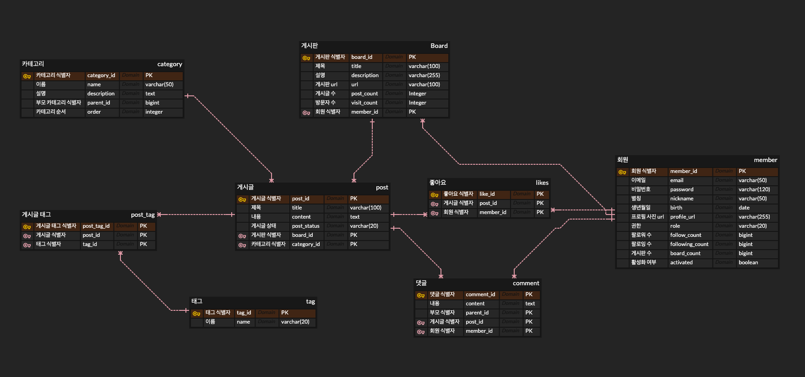

# SNS형 개발자 게시판 서비스

## 📚 개요

개발자들이 SNS나 blog로 개인 생각을 많이 공유하고 있습니다. 하지만 많은 개발자들은 facebook이나 linkedIn과 tistory등 다양한 플랫폼에 비슷한 글을
여러번 올려 다양한 사람들에게 공유하고자 하는 노력을 하게 됩니다.

우리 플랫폼은 그런 문제를 해결합니다. 개발자에게 SNS겸 blog를 동시에 제공함으로써 소통과 지식 공유를 자유롭게 할 수 있게 합니다.

기술적으로는 SNS에서 지인 추천 시스템, 게시판과 게시글 CRUD를 좀 더 간편하고 고가용성으로 운영 가능하게 기술력으로 풀어나갈 것입니다.

## ⚙️ Tech-Stack 

**Back-End**

- Spring boot 3.x.x
- Kotlin
- OpenJDK 17

**DataBase**

- MySQL 8.0.22 (persist)
- Redis 7 (cache)
- neo4j 5.12(friend relationShip)

**Front-End**

- Flutter (미정)

## 🏃‍ 프로젝트 주요 과제 

- 대용량 트래픽을 견딜 수 있는 설계를 할 것 (pod 개수를 무한정 늘리지 않더라도 일정 수준의 TPS는 버틸 수 있게)
- 자주 조회되는 데이터는 최대한 caching 하여 DB 부하를 분산시킬 것
- 개발자 글은 변경사항이 크게 많지 않다. 핵심 내용은 벗어나지 않는다.
  - cache TTL은 어느 정도 길게 게시글의 경우엔 1분 이상 길게 가져갈 수 있도록하자.
  - 게시글을 쓰는 순간 그리고 상세 조회 하는 순간 caching 하여 초반 글이 상단에 위치할 때 자주 조회되었을 때 부하를 줄여보자.
- 코드 컨벤션을 지키고 최대한 단일 책임 원칙에 가깝게 코드 설계를 하자

## 🌐 ERD

## 🚥 코드 컨벤션

- 3개 이상의 데이터를 request로 받는 경우 DTO를 사용한다. 
- if 또는 for 문의 뎁스는 최대 1개를 넘지 않는다. 
- 레이어간 서로 다른 DTO가 활용 되어야 한다.
- 디자인 패턴을 활용한다. 
- 레이어드 아키텍처를 지향하고 최대한 인터페이싱하여 유연한 설계를 한다. 
- JPA의 효율적인 사용을 위해 Domain 계층과 Entity를 분리하지 않되 최대한 Entity를 도메인 모델과 유사하게 설계한다. 
- REST에 response와 request는 모두 명확해야한다. (true, false 금지)
- Controller와 Service Dto는 REST Method로 구분한다. 
- 비즈니스 로직이 길어지면 Facade를 고려한다.
- 테스트 코드는 필수이다. 80% 이상을 고수하여야 한다. (서비스, 핸들러 등 기본 로직 단위 테스트와 통합 테스트는 필수)

## Git branch 

## 📔 Commit Message Convention

{branch name}/{issue number}/{commit message}

ex) feature/#001/지인추천모델개발

1. feature: 새로운 기능의 추가
2. hotFix: 버그수정
3. docs: 문서 수정

## 중간 중간 이슈 트래킹 또는 주요 변경 사항 의사결정 과정 

### QueryDSL to JDSL migration
https://github.com/ilgolf/blog_for_developer/issues/14
